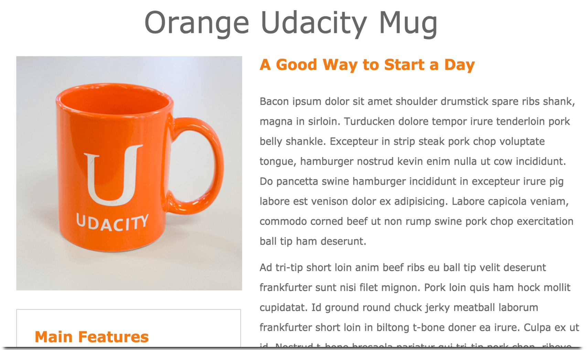

#Mockup to Website

This was the first project as part of Udacity's Front End Web Developer Nanodegree. I was provided with a design mockup PDF-file and had to replicate that design using HTML and CSS. The final submission of this project had to have less than an 8% margin of error.

###Technologies Used:
* HTML
* CSS
* Bootstrap
* Responsive Design

###Demo:

You can view this project [**here!**](http://samurairanderson.github.io/P1-Mockup-to-Website)

